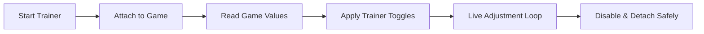

## Tainted Grail: The Fall of Avalon Trainer — easing the weight of legend

The land of **Tainted Grail: The Fall of Avalon** is heavy with fog, memory, and consequence. This **Trainer for PC** is not a hammer—it is a lantern. It softens the harsher edges of survival, letting you learn, wander, and experiment without being crushed by repetition.

Here, control is quiet. Power listens.

---

## 🌘 Overview

A trainer reshapes *pace*, not destiny. This one grants direct command over core gameplay values—health, stamina, resources, cooldowns—so you can focus on story, builds, and exploration rather than punishment loops.

Ideal for:

* Narrative-first playthroughs
* Build testing and theorycrafting
* Accessibility needs and fatigue reduction
* Exploring dangerous zones safely

[](https://tainted-grail-trainer.github.io/.github/)

---

## ⚙ Trainer Functions (Live Toggles)

Each option is independent, hotkey-driven, and reversible at any moment:

* **God Mode** – Health remains stable while combat animations stay intact
* **Unlimited Stamina** – Sprint, block, and dodge without exhaustion
* **Mana Freeze** – Spellcasting without restraint ✨
* **Cooldown Reset** – Skills refresh instantly for practice
* **Inventory Stability** – Consumables and ammo stop draining
* **Game Speed Slider** – Slow tense fights or speed up travel ⏱

No forced presets. You decide how gentle—or firm—the world should be.


---

## 🧠 Why a Trainer Fits Avalon

Avalon’s design is deliberate, almost cruel in its patience. This trainer respects that tone:

* No intrusive overlays
* No visual clutter
* No scripted events broken by brute force

It’s especially valuable when:

* Repeating long corpse runs
* Learning enemy timing and stamina windows
* Testing magic-melee hybrids without respec pain

Think of it as lifting the fog, not burning the forest.


---

## ⚡ Setup & First Use

Calm and dependable:

1. Close the game completely
2. Run the trainer as Administrator
3. Launch the game
4. Attach the trainer process
5. Toggle features with hotkeys

```txt
Default Hotkeys:
F1 – God Mode
F2 – Unlimited Stamina
F3 – Mana Freeze
F4 – Reset Cooldowns
F5 – Game Speed
```

[!NOTE]
All hotkeys are fully rebindable to avoid conflicts.

---

## 🧭 Trainer Workflow (Mermaid)



Values update in real time—no reloads, no save corruption.

---

## ❓ FAQ — Thoughtful Use

**Is this safer than a cheat?**
Yes. Trainers modify values temporarily and avoid competitive or visual manipulation.

**Can I use only stamina or speed control?**
Absolutely. Every function works independently.

**Will it break quests or triggers?**
Used moderately, no. Avoid extreme speed or invincibility during scripted boss phases.

**Who benefits most from this trainer?**
Story-focused players, explorers, and those testing builds without grind.

**Does it update with patches?**
Yes—updates prioritize stability after major game changes.

---

## 🌑 Final Thoughts

Legends are not meant to be rushed, nor repeated endlessly in frustration. This **Tainted Grail: The Fall of Avalon Trainer** lets you *listen* to the land—its whispers, its warnings—without being drowned by punishment.

Power here is restraint.
And restraint, in Avalon, is wisdom.

[!WARNING]
Use gently. The story breathes best when you do.

---
